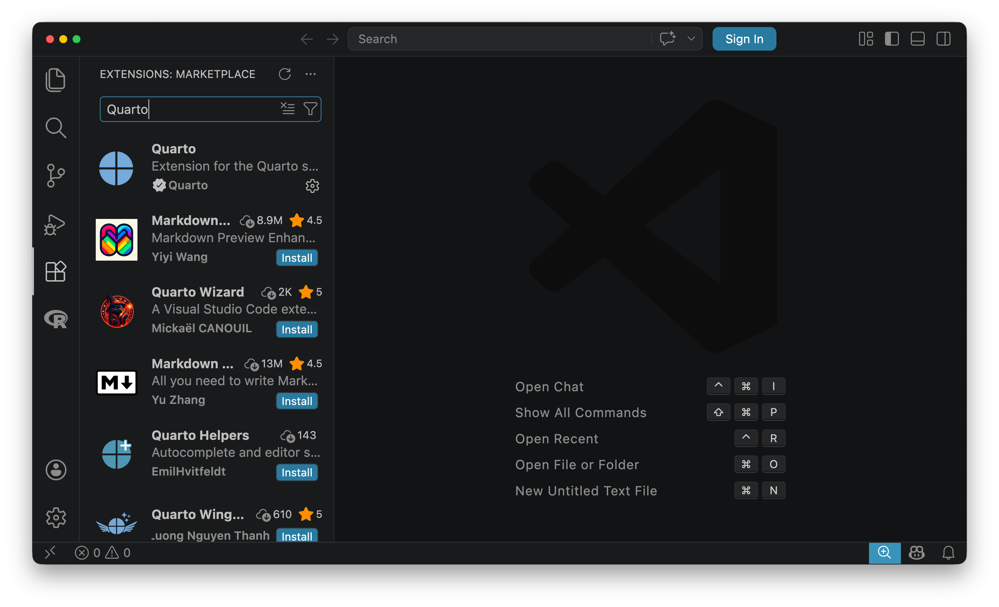

---
execute:
  echo: false
---

# この授業について {.unnumbered}

```{r}
#| label: setup
library(tinytable)
```


## 日程

```{r}
#| label: schedule
schedule <- data.frame(
  week = 1:16,
  date = c(
    seq(as.Date("2026-04-10"), by = "weeks", length.out = 4),
    seq(as.Date("2026-05-15"), by = "weeks", length.out = 12)
  ),
  topic = c(
    "イントロダクション",
    "引用・プレゼンテーションの方法",
    "発表: グループ1",
    "発表: グループ2",
    "発表: グループ3",
    "発表: グループ4",
    "発表: グループ5",
    "発表: グループ6",
    "データ分析の基礎1",
    "データ分析の基礎2",
    "発表: グループ1",
    "発表: グループ2",
    "発表: グループ3",
    "発表: グループ4",
    "発表: グループ5",
    "発表: グループ6"
  )
)

# Write static/schedule.csv for calendar integration
schedule_csv <- data.frame(
  date = schedule$date,
  start = format(
    as.POSIXct(paste(schedule$date, "08:50:00"), tz = "Asia/Tokyo"),
    tz = "UTC",
    format = "%Y-%m-%dT%H:%M:%SZ"
  ),
  title = schedule$topic,
  rnum = schedule$week,
  end = format(
    as.POSIXct(paste(schedule$date, "10:20:00"), tz = "Asia/Tokyo"),
    tz = "UTC",
    format = "%Y-%m-%dT%H:%M:%SZ"
  ),
  summary = paste0("基礎演習: ", schedule$week, ". ", schedule$topic),
  location = "アカデミア館503",
  description = "https://kazuyanagimoto.com/course-first-year-2025/"
)

write.csv(schedule_csv, here::here("static/schedule.csv"), row.names = FALSE)

schedule |>
  tt()
```

## 課題

この授業では次のような基準で成績が評価されます:

1. グループでのプレゼンテーション (40%)
1. コメント提出と授業への参加状況 (30%)
1. グループでの期末レポート (30%)

### 1. グループでのプレゼンテーション

この授業では, 6人程度のグループに分かれて, 教科書の内容をプレゼンテーションしてもらいます. プレゼンテーションは2回あり, 1回目は教科書の内容を正確に説明することを目的とし, 2回目は教科書の内容を踏まえて, 気になるテーマについて新たな図表を作成し, 発表することを目的とします.

プレゼンテーション自体はグループのうち誰が行なっても構いませんが, スライドの内容についてはグループのメンバー全員が理解している必要があります. そのため, プレゼンの最中に発表者とは別のメンバーに内容について質問することがあります.

### 2. コメント提出と授業への参加状況

各グループのプレゼンテーションにあたり, 発表するグループ以外の学生は, 事前に教科書を読んで, 一人2つ以上のコメントを提出することを求めます. 内容は, 教科書の内容で疑問に思った点や, 他の研究の可能性など, 授業中の議論のきっかけになるようなものとします.

Google Forms にて, 授業の前日 (23:59JST) までに提出してください. 全てのコメントを拾い上げることはできないため, 毎回ランダムでコメントを選びます. コメントが選ばれた学生は, そのコメントについて説明してください. その後, コメントに対して質問や議論などを行います.

### 3. グループでの期末レポート

期末レポートは, グループ単位で提出してください. 内容は, 後半のプレゼンテーションで発表した内容をまとめたものとします. 授業では学術論文の形式についても扱うので, 内容というよりも, 形式に沿って正確に記述できているかを評価します.

### AIの利用

この授業では, 生成AIの利用を奨励します. ただし, 提出物の責任は全て, 作成した学生本人にあることを理解してください. 特に, 次の点に注意してください.

**1. 内容を理解する**

プレゼンやコメントに対して, こちらから質問することがあります. その際, スライドの記述やコメントの内容を説明できない場合は, 仮に記述そのものがあっていても理解できていないと判断します. 生成AIはあくまでも補助ツールであり, 提出物の内容は学生本人の主張でなければなりません.

**2. 不正行為に注意する**

生成AIは, 時に, 事実と異なる内容を生成することがあります. 仮に, 存在しない文献を引用していたり, 事実と異なる内容が含まれていた場合は, それが重大な不正行為とみなされる可能性があります. 生成AIを利用する場合は, 必ず事実確認を行い, 不正行為にならないように注意してください.

## 授業の進め方

この授業では, 教員による講義形式の日と, 学生の発表形式の日があります. 学生の発表形式の場合, 以下のような流れになります.

1. 担当者のプレゼンテーション (30分程度)
1. コメントと議論 (30分程度)
1. 教員からのフィードバック (10分程度)
1. ツール等の追加的な説明 (20分程度)

基本的には, プレゼンテーションとコメント・議論の時間をメインとします. 余った時間で, ツール (QuartoやR) の使い方を説明することもありますが, 議論が活発な場合は, そちらを優先します.

## ツール

この授業では, 以下のツールを使用します. これらのツールは, すべて無料で利用できます.

- [VS Code](https://code.visualstudio.com/): テキストエディタ. レポートやスライドの作成に使用します.
- [Quarto](https://quarto.org/): ドキュメント作成ツール. レポートやスライドの作成に使用します.
- [Zotero](https://www.zotero.org/): 文献管理ツール. 文献の管理と引用に使用します.

各公式サイトからそれぞれダウンロードしてインストールするという方法がありますが, 私はコマンドラインからインストールする方法をお勧めします. これにより, 今後のアップデートも簡単に行えるようになります.

### インストール

::: {.panel-tabset}

## Windows

Windows では標準のパッケージマネージャ [winget](https://learn.microsoft.com/ja-jp/windows/package-manager/winget/) を使うと, まとめて導入できます.

- まず PowerShell を開き, `winget --version` が動くことを確認してください.
- 以降のコマンドは, 基本的に PowerShell でそのまま実行できます.

```powershell
# VS Code
winget install -e --id Microsoft.VisualStudioCode --accept-source-agreements --accept-package-agreements

# Quarto
winget install -e --id Posit.Quarto --accept-source-agreements --accept-package-agreements

# Zotero
winget install -e --id Zotero.Zotero --accept-source-agreements --accept-package-agreements
```

もし `--id ...` が見つからない場合は, `winget search vscode` や `winget search quarto` のように検索して表示された ID を使ってください. 

## Mac

Mac では [Homebrew](https://brew.sh/) を使うのが簡単です. Homebrew が入っていない場合は, まず以下をターミナルで実行します.

```bash
/bin/bash -c "$(curl -fsSL https://raw.githubusercontent.com/Homebrew/install/HEAD/install.sh)"
```

その後, 以下のコマンドでツールをまとめてインストールできます.

```bash
brew update

# VS Code
brew install --cask visual-studio-code

# Quarto
brew install --cask quarto

# Zotero
brew install --cask zotero
```

もし見つからない場合は, `brew search quarto` のように検索して cask 名を確認してください. インストール後, 次のコマンドで確認できます.

:::

インストール後はPowershell/ターミナルを再起動してから, 次のコマンドでversionが表示されることを確認してください.

```bash
quarto --version
```

### アップデート


::: {.panel-tabset}

## Windows

```powershell
# 更新があるソフトの一覧を表示
winget upgrade

# まとめて更新
winget upgrade --all --accept-source-agreements --accept-package-agreements

# 個別に更新(必要なものだけ)
winget upgrade -e --id Microsoft.VisualStudioCode --accept-source-agreements --accept-package-agreements
winget upgrade -e --id Posit.Quarto --accept-source-agreements --accept-package-agreements
winget upgrade -e --id Zotero.Zotero --accept-source-agreements --accept-package-agreements
```

## Mac

```bash
# Homebrew 自体とレシピ情報を更新
brew update

# 更新があるものの一覧
brew outdated --cask

# まとめて更新
brew upgrade --cask

# 個別に更新(必要なものだけ)
brew upgrade --cask visual-studio-code
brew upgrade --cask quarto
brew upgrade --cask zotero
```

:::

### VS Codeの拡張機能

VS Code には, QuartoやRを使うための拡張機能があります. これらを入れると, コードの補完や, Quartoのコンパイルなどが簡単にできるようになります. VS Code の拡張機能のタブで, "Quarto" や "R" で検索してインストールしてください.

